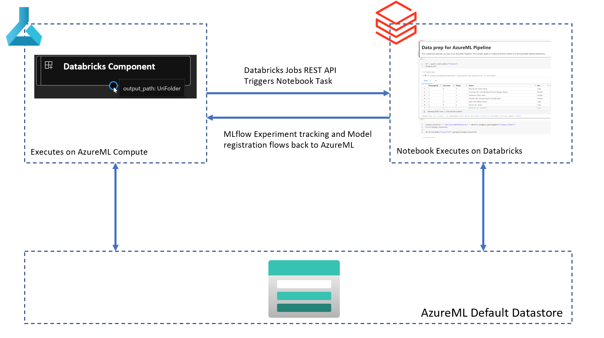
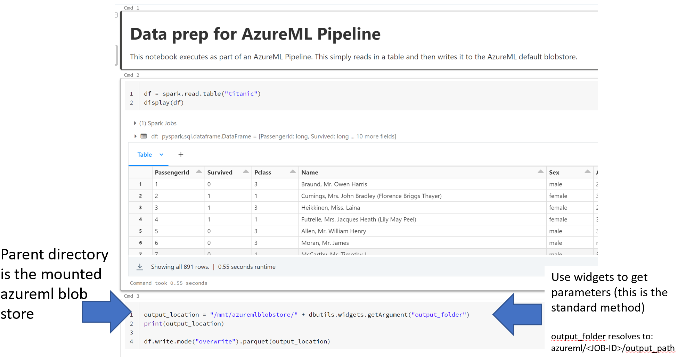
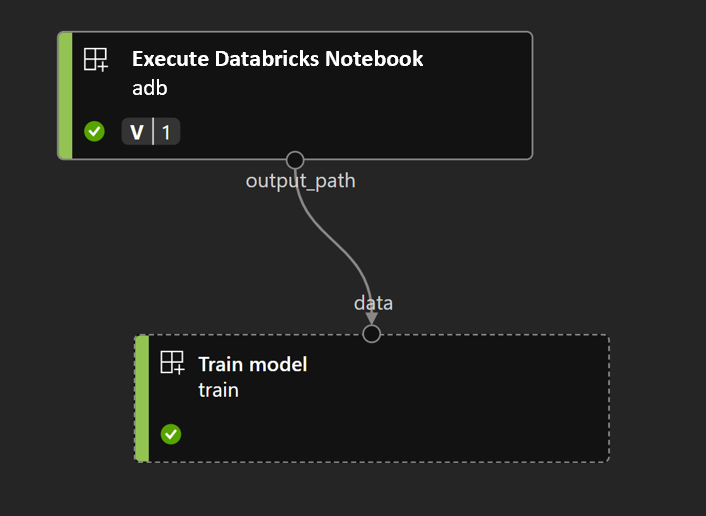

# Create an AzureML Databricks Component

 This repo demonstrates how you can create AzureML *Component* that will execute a notebook in your Databricks workspace using the [Databricks REST API](https://learn.microsoft.com/en-gb/azure/databricks/dev-tools/api/latest/). You can consume this component in an AzureML pipeline so that you can orchestrate Databricks jobs as part of your workflow - for example, to access data in your Databricks Tables and/or pre-processing of data.

## 📐 Architecture



## ⚙️ Set-up

### 💾 Mount the AzureML Workspace Blob Store in Databricks
AzureML Pipelines write intermediate data to the default AzureML Workspace Blob storage container. Therefore, you need to mount this *in Databricks* using:

```python
container_name = "azureml-blobstore-<id>"
storage_name = "<storage-name>"
uri = f'wasbs://{container_name}@{storage_name}.blob.core.windows.net'
blob_config = f'fs.azure.account.key.{storage_name}.blob.core.windows.net'

dbutils.fs.mount(
  source = uri,
  mount_point = "/mnt/azuremlblobstore",
  extra_configs = {blob_config:dbutils.secrets.get(scope = "<scope-name>", key = "<key-name>")})
```

### 🔑 Store your Databricks personal access token in Azure Key vault

Generate a personal access token (PAT) in Databricks. If you are unsure how to do this, please follow [Generate a personal access token](https://learn.microsoft.com/en-us/azure/databricks/dev-tools/api/latest/authentication#--generate-a-personal-access-token). In your AzureML Key vault, create a secret called `ADBPAT` that stores your PAT:

```bash
az keyvault secret set --name ADBPAT --vault-name <AzureMLKeyVault> --value <databricks-pat-token>
```

> **NOTE** To set and access Key vault secrets you should [assign a Key vault access policy](https://learn.microsoft.com/en-us/azure/key-vault/general/assign-access-policy?tabs=azure-portal) to:
> 1. your AAD *and*
> 1. the managed identity of your AzureML Compute Cluster.

### 🖼️ Create a Databricks Environment in AzureML
To call the Databricks REST API with Python in your component, you'll need an AzureML *environment* that contains:

- [Databricks CLI Python library](https://github.com/databricks/databricks-cli) to programmatically manage various Azure Databricks resources.
- Azure Keyvault and Identity Python Libraries to securely connect to and manage your Databricks PAT token.

To create your Databricks environment in AzureML, execute the following in a terminal:

```bash
cd ./azureml-sdkv2-databricks/databricks-component
az ml environment create -f databricks-environment.yml --version 1
```

## 📦 Create a Databricks Component
To create the Databricks component, execute the following commands in your terminal:

```bash
cd ./azureml-sdkv2-databricks/databricks-component
az ml component create -f databricks-component.yml --version 1
```

### 🎓 Understanding the component

The `databricks-component.yml` file defines the specification of the Databricks component:

```yaml
$schema: https://azuremlschemas.azureedge.net/latest/commandComponent.schema.json
type: command

name: execute_databricks_notebook
display_name: Execute Databricks Notebook
description: Execute a notebook as a Spark job in databricks

code: ./src

environment: azureml:databricks:1

command: >-
  python databricks_control.py
  --databricks-host ${{inputs.databricks_host}}
  --notebook_path ${{inputs.notebook_path}}
  --keyvault-url ${{inputs.kv_url}}
  --keyvault-secret-name ${{inputs.kv_secret_name}}
  --num-workers ${{inputs.num_workers}}
  --node-type-id ${{inputs.node_type_id}}
  --spark-version ${{inputs.spark_version}}

inputs:
  databricks_host:
    type: string
  notebook_path: 
    type: string
  kv_url:
    type: string
  kv_secret_name:
    type: string
  num_workers:
    type: integer
  node_type_id:
    type: string
  spark_version: 
    type: string

outputs:
  output_path:
    type: uri_folder
    mode: direct
```

This component will take in a number of parameters such as the Databricks host name, number worker nodes, the Databricks runtime, etc. On AzureML compute, it will then execute the command `python databricks_control.py`. The `databricks_control.py` Python script uses the `databricks-cli` library to initiate a (notebook) task in Databricks, and will output a folder of parquet data.

### 🎓 Understanding `databricks_control.py`
To run a notebook (or python file/jar/sql task/dbt task) using the `databricks-cli` Python library requires 3 steps:

1. Connect to Databricks using `ApiClient`.
1. Specify the databricks job definition. For example, the cluster size, Spark version, libraries to install, init scripts, etc
1. Submit the job run using the `RunsApi`.

```python
import argparse
import time
import os
from azure.identity import DefaultAzureCredential
from azure.keyvault.secrets import SecretClient
from databricks_cli.runs.api import RunsApi
from databricks_cli.sdk import ApiClient

# Parse arguments
parser = argparse.ArgumentParser()
parser.add_argument("--databricks-host", type=str)
parser.add_argument("--notebook_path", type=str)
parser.add_argument("--keyvault-url", type=str)
parser.add_argument("--keyvault-secret-name")
parser.add_argument("--num-workers", type=int)
parser.add_argument("--node-type-id", type=str)
parser.add_argument("--spark-version", type=str)

args = parser.parse_args()

#   generate the output path. AzureML pipelines use the default datastore
#   to store the intermediate outputs. The form of the path that is used
#   is azureml/<RUN-ID>/<NAME_OF_OUTPUT>. The name of the output in the component
#   is output_path, which is specified in the component yaml file:
#   outputs:
#    output_path:
#      type: uri_folder
#      mode: direct

OUTPUT_PATH = os.path.join('azureml', os.getenv('AZUREML_RUN_ID'), 'output_path')

# Get the Databricks personal access token from Key Vault
print("getting secret from key vault...", end=" ")
credential = DefaultAzureCredential()
client = SecretClient(vault_url=args.keyvault_url, credential=credential)
secret = client.get_secret(args.keyvault_secret_name)
print("done")

# Connect to Databricks using ApiClient
print("creating databricks api client...", end=" ")
api_client = ApiClient(host=args.databricks_host, token=secret.value)
print("done")

#   Create the Databricks Jobs specification according to 
#   https://docs.databricks.com/dev-tools/api/latest/jobs.html
job_spec = {
    "name": os.getenv('AZUREML_RUN_ID'),
    # create a new (on-demand) cluster to run the job
    "new_cluster": {
        "spark_version": args.spark_version, 
        "node_type_id": args.node_type_id, 
        "num_workers": args.num_workers, 
        # passthrough the AzureML MLFLow details so that tracking is done
        # in AzureML
        "spark_env_vars":{
            "MLFLOW_TRACKING_URI": os.getenv('MLFLOW_TRACKING_URI'),
            "AZUREML_RUN_ID": os.getenv('AZUREML_RUN_ID'),
            "MLFLOW_EXPERIMENT_ID": os.getenv('MLFLOW_EXPERIMENT_ID'),
            "MLFLOW_TRACKING_TOKEN": os.getenv('MLFLOW_TRACKING_TOKEN'),
            "MLFLOW_RUN_ID": os.getenv('MLFLOW_RUN_ID'),
            "MLFLOW_EXPERIMENT_NAME": os.getenv('MLFLOW_EXPERIMENT_NAME')
        }
    },
    # Run a notebook - it is possible to run other task types too, for 
    # example a python script/jar/SQL/dbt task.
    "notebook_task": {
        "notebook_path": args.notebook_path,
        "base_parameters": {
            # resolves to azureml/<RUN-ID>/output_path
            "output_folder": OUTPUT_PATH
        }
    },
    # libraries to install on the cluster. Here we install the azureml-mlflow
    # library so that we can use the AzureML MLFlow tracking store.
    "libraries": [
        {
            "pypi": {
                "package": "azureml-mlflow"
            }
        }
    ]
}

# Submit the Run
print("submitting databricks run...", end=" ")
runs_api = RunsApi(api_client)
run_id = runs_api.submit_run(job_spec)["run_id"]
print("done")

# Wait for the run to complete
my_run = runs_api.get_run(run_id)
while my_run["state"]["life_cycle_state"] != "TERMINATED":
    my_run = runs_api.get_run(run_id)
    print(f'state of run {run_id} is {my_run["state"]["life_cycle_state"]}')
    time.sleep(10)
```

The above code is capable of running any notebook as a *notebook task*, which means the component can be re-used for different notebooks, cluster sizes, etc by changing the input parameters. However, you may want to make your component more *specific*. For example, if the intent of your component is to process specific Spark Tables in Databricks and output specific data, you'll probably want to encapsulate that in the component with the optimized Spark settings).

## 🚀 Consume the Databricks Component in an AzureML Pipeline

An example [*databricks* notebook](./pipeline/databricks-notebook.ipynb) is provided, which takes a Databricks Spark Table and outputs it to parquet in the AzureML default blobstore:



The key part of this notebook is the last cell:

```python
output_location = "/mnt/azuremlblobstore/" + dbutils.widgets.getArgument("output_folder")
print(output_location)

df.write.mode("overwrite").parquet(output_location)
```

Here the `/mnt/azuremlblobstore` is the mount point of the AzureML workspace blobstore defined in the [set-up](#💾-mount-the-azureml-workspace-blob-store-in-databricks). The widget gets the argument `output_folder` which was defined in the Databricks component. The `output_location` will resolve to `/mnt/azuremlblobstore/azureml/<RUN-ID>/output_path`.

An example AzureML pipeline to execute a Databricks notebook can be found [here](./pipeline/pipeline-with-databricks.ipynb). The pipeline is created using the V2 SDK:

```python
from azure.ai.ml.dsl import pipeline
from azure.ai.ml import load_component

databricks = ml_client.components.get(name="execute_databricks_notebook", version="1")
train_model = load_component("./train_component.yml")

@pipeline()
def my_pipeline_with_databricks():

    adb = databricks(
        databricks_host="https://adb-<number>.<2digitnumber>.azuredatabricks.net/",
        notebook_path="/Users/<user_name>/<notebook_name>",
        kv_url="https://<keyvault_name>.vault.azure.net/",
        kv_secret_name="<secret_name_for_databricks_token>",
        num_workers=2,
        node_type_id="Standard_D3_v2",
        spark_version="7.3.x-scala2.12"
    )
    adb.outputs.output_path.mode = "upload"

    train = train_model(data=adb.outputs.output_path)

pipeline_job = my_pipeline_with_databricks()

# set pipeline level compute
pipeline_job.settings.default_compute = "cpu-cluster"
```

The pipeline has two steps:

